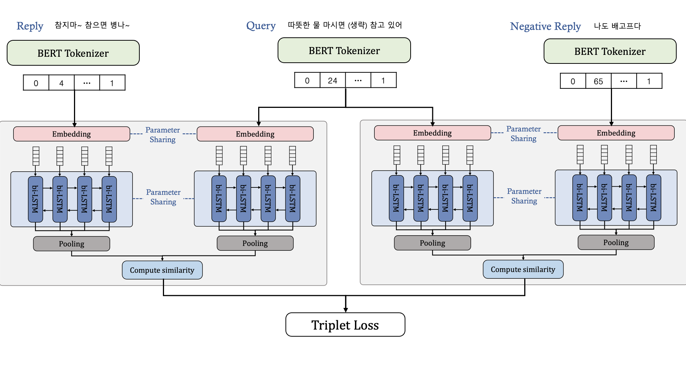
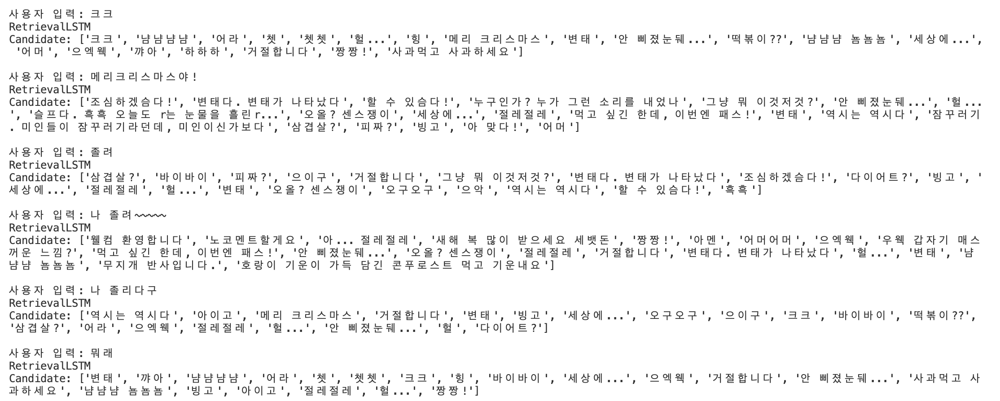

# **AI Chatbot based on QA-LSTM🤖**

  

### **2016 ICLR LSTM-based Deep Learning Models for Non-factoid Answer Selection**

QA-LSTM과 QA-LSTM with Attention 모델 구현 (`avg_pooling`/`max_pooling`)

 
<br>

-----
  

### 👉 **Word Embedding**

&nbsp;&nbsp;&nbsp;&nbsp;**Pretrained Embedding**: KoBERT `monologg/kobert`을 사용한 BERT 임베딩

```
python main.py <생략> --embed bert
```


&nbsp;&nbsp;&nbsp;&nbsp;**Embedding Layer**: nn.Embedding을 이용한 임베딩

```
python main.py <생략> --embed nn
```
<br>
<br>

-----
### **모델 프레임워크**

<br>
<div  align=left>
<br>
QA-LSTM
</div>
<br>


<br>
<div  align=left>
<br>
QA-LSTM with attention
</div>
<br>

  
  

👉 **Attention mechanism**  
&nbsp;&nbsp;Bahdanau Attention mechanism 사용

<br>

-----

### **모델 훈련**
**Multi GPU**
```
python main.py --cuda --gpuid [list of gpuid] --data_dir [data dir path] --method [pooling type] --embed [embedding method] --max_epochs 10 --train --model_name [model_name] --accelerator ddp
```

**Single GPU**
```
python main.py --cuda --gpuid 0 --data_dir [data directory path] --method [pooling type] --embed [embedding method] --max_epochs 10 --train --model_name [model_name]
```

- data_dir: `train.csv`, `val.csv`가 있는 디렉토리 경로
- method: `avg_pooling` or `max_pooling`
- gpuid: GPU ID 리스트
	- ex) `--gpuid 0 1 2`
- embed: 
	- `bert` : 사전학습된 KoBERT 임베딩 (`monologg/kobert` 사용)
	- `nn` : torch.nn.Embedding Layer  

### **모델 검증**

```
python main.py --cuda --model_pt [model path] --gpuid [gpu id] --data_dir [data directory path]
```

- data_dir: `reaction_emb.pickle`이 있는 디렉토리 경로 (없는 경우 새로 생성)
- method: `avg_pooling` or `max_pooling` (학습된 모델과 동일한 pooling method 선택)
- model_pt: 모델 체크포인트 경로 
	- ex) `--model_pt model_ckpt/qa_lstm-epoch\=04-train_loss\=0.05.ckpt`
- gpuid: 하나의 GPU ID 
- embed: 
	- `bert` : 사전학습된 KoBERT 임베딩 (`monologg/kobert` 사용)
	- `nn` : torch.nn.Embedding Layer  

#### **모델 검증 예시**


<br>
<div  align=left>
<br>
</div>
<br>

> **Model Info**   
>&nbsp;&nbsp;&nbsp;&nbsp;Model : QA-LSTM  
&nbsp;&nbsp;&nbsp;&nbsp;pooling : max_pooling  
&nbsp;&nbsp;&nbsp;&nbsp;embedding method: nn.Embedding Layer  
