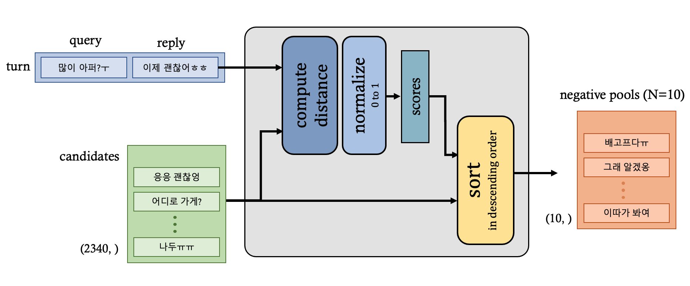

# **데이터 정보**

### **전처리**

1. 태그 제거
이모티콘 태그가 달린 경우 태그만 제거, 그 이외의 태그는 데이터 삭제

2. 연속된 반복 문자 제거
`num_repeats` = 3

3. 이모지 제거
4. URL 또는 코드가 포함된 경우 데이터 삭제
    - url 제거 정규식 : 
    `(?:(?:https?|ftp):\/\/)?([a-zA-Z\_/\-?=%]+\.){2,}`  

    - 코드 제거 정규식: 
   `[a-zA-Z\_]+\.[a-zA-Z\_]+\((\s)*[a-zA-Z0-9\_.+-\<\>,\[\'\"=]*^&!]*(\s)*\)`, 
   `[a-zA-Z0-9\_]+(\s)*\=(\s)*[a-zA-Z0-9\[\]\(\)\.,?!|\+\*\-\#\^\%\~\<\>\{\}\_]+`

5. 기사, 광고 등의 문구가 포함된 경우 데이터 삭제
    - 대괄호 기반 탐지 정규식 : 
    `\[[^\[\]]\]`  

6. 특수 문자 제거 
    - 특수문자 탐지 정규식 : 
    `[^a-zA-Z가-힣0-9ㄱ-ㅎㅜㅠ\.\,\!\?\s\~]`  

7. 시퀀스 길이 
`kobert_transformers`의 토크나이저 사용 (`vocab_size`: 8002)
query가 2 초과 128 미만의 길이를 갖도록 전처리 (약 11만개의 데이터 삭제)

 

### **Negative Pool 구성**

   

 
Negative Pool 구성

 
